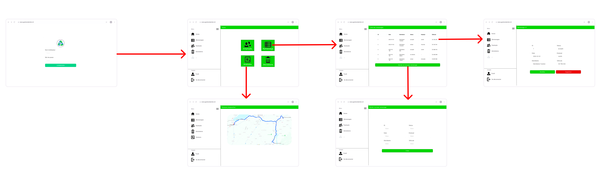

## Landing page

https://pdg-gr9-gestion-decheterie.github.io/

## Schéma Mockup

**Écran de connexion :** L'utilisateur démarre en saisissant son nom d'utilisateur et son mot de passe sur une page de connexion sécurisée pour accéder au système.

**Accueil après connexion :** Une fois connecté, l'utilisateur arrive sur la page d'accueil du logiciel. Cette page présente différentes options de navigation, telles que "Employés", "Ramassage", "Véhicules", et "Déchetèries", chacune représentée par un bouton distinct. A savoir que ceci n'est qu'un exemple. Les boutons pourront varier selon la personne connecté (ou tout simplement être remplacés par autre chose).

**Itinéraire :**  Cette page est dédiée aux chauffeurs et leur permet de visualiser l'itinéraire de leurs ramassages pour la journée. La carte affiche les trajets planifiés, facilitant ainsi la navigation pour les chauffeurs.

**Sélection de "Ramassage" :** L'utilisateur sélectionne l'option "Ramassage" pour accéder à la gestion des ramassages. Cela les redirige vers une page qui lui permet de voir la liste de ramassages concernant ses déchèteries.

**Détail d'un Ramassage :** En cliquant sur un ramassage spécifique dans la liste, l'utilisateur est dirigé vers une page de détails. Cette page affiche des informations complètes sur le ramassage sélectionné, y compris l'itinéraire sur une carte, l'état actuel du ramassage, et d'autres informations critiques.

**Modification/Suppression :** L'utilisateur a également la possibilité de modifier les détails du ramassage ou de le supprimer.

**Ajout de Ramassage :** L'utilisateur peut remplir un formulaire pour ajouter un nouveau ramassage, en renseignant toutes les informations nécessaires telles que l'ID, la date, le véhicule utilisé, etc. avant de sauvegarder ces informations.

**Autres Modules :** Bien que ce mockup se concentre sur la fonctionnalité "Ramassage", les autres modules comme "Employés", "Véhicules", "Déchetèries", etc. suivent une logique similaire.
L'utilisateur peut accéder à ces sections depuis le menu, visualiser des listes d'éléments (employés, véhicules, etc.), consulter des détails spécifiques, ajouter de nouveaux éléments, et modifier ou supprimer les existants.

## Template used

Template Name: Arsha
Template URL: https://bootstrapmade.com/arsha-free-bootstrap-html-template-corporate/
Author: BootstrapMade.com
License: https://bootstrapmade.com/license/
